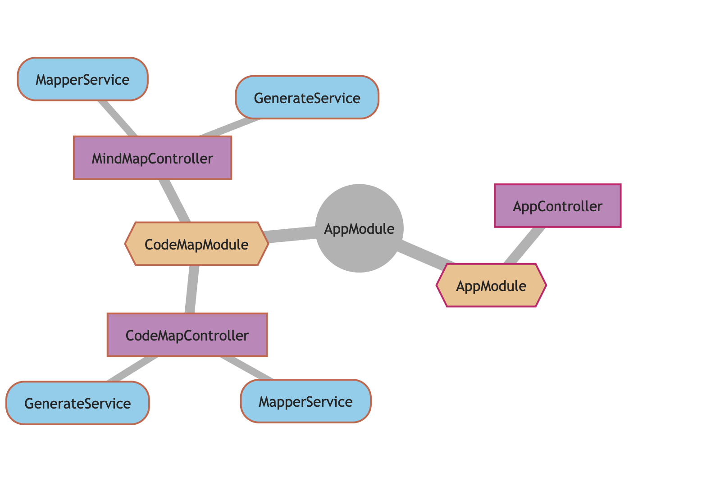

# Codex 

## _Visualize your code_



```
npm i -g @methodus/codex

```

```
codex [maptype] [project-folder]
```

> Use the codex [maptype] command to generate visualizations of your code

> **mindmap** | **codemap** | **flowmap**


[](https://sonarcloud.io/summary/new_code?id=nodulusteam_methodus-codex)
